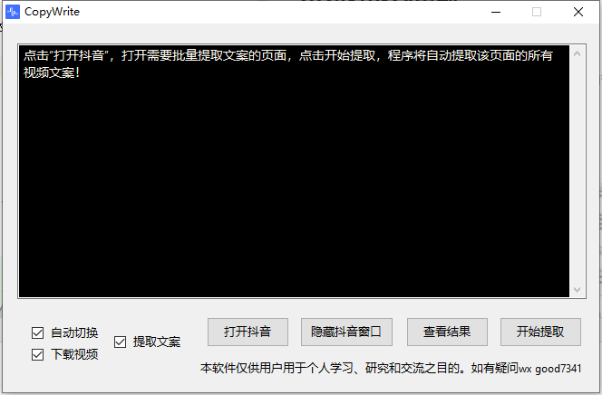

# 抖音视频文案批量提取

## 介绍

基于Puppeteer实现，运行exe之后会自动打开抖音网页版。 点击开始提取后，会自动下载并识别当前视频的文案，识别完成之后自动播放下一个视频继续识别

> 有问题请联系微信good7341

## 截图演示：

提供以及编译好的，绿色免安装的可执行文件，无需额外操作，自带免费识别接口（2分钟以内的视频)，[点击下载 douyin.exe](dist/douyin.exe)

20251116更新：~~免费接口用不了了，目前还能批量下载视频，但是识别文案得自己买第三方的文案识别的接口对接~~

## 项目

项目源代码分为两部分exe和puppeteer脚本

* exe，基于aardio实现，官网：https://www.aardio.com
* script，编译后会生成一个单文件脚本，打开exe的脚本管理，改成douyin.js，复制到plugin目录